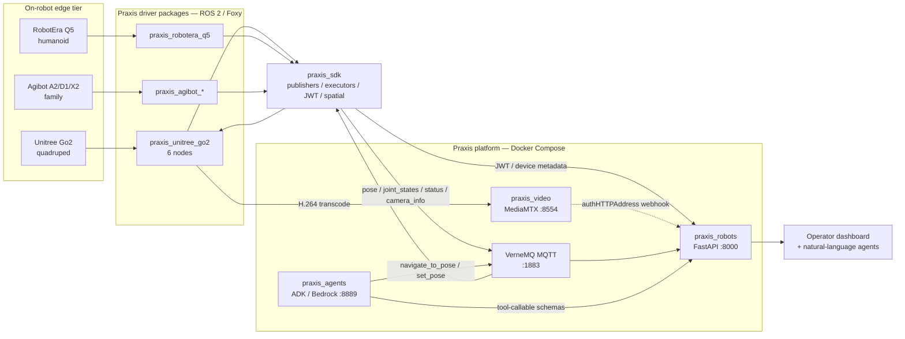

---
aliases:
  - 2026-W26
---

# Biweekly

## June 27, 2026

### Summary
Shipped end-to-end integration of the Unitree Go2 quadruped into the Praxis multi-robot platform — a six-node ROS 2 driver bridging the proprietary Unitree SDK to Praxis's vendor-agnostic Pydantic-typed action/telemetry abstractions, alongside a complete deployment pipeline (deploy_ros bootstrap + tmuxinator profiles + Docker Compose orchestration) that brings the whole stack online from a clean shell with one alias. The driver has since been validated as the reusable template for Agibot A2/D1/X2 and additional RobotEra Q5 robots, with cloud-side ADK/Bedrock agents now driving any of them by natural language. Phase 1 of the period delivered the RobotEra Q5 dataset collection pipeline (multi-threaded sensor fusion, OpenCV camera calibration, trajectory visualisation).

### Shipped
- **`praxis_unitree_go2` ROS 2 driver package** — six runtime nodes plus utility libraries, scaffolded via `create_driver.sh` template instantiator, registered as `ament_python` entry points so each node is launchable via `ros2 run`:
  - `translate_and_rotate_executor` — MultiThreadedExecutor unifying pose publishing, dead-reckoning integration, and the two-phase `set_pose`/`navigate_to_pose` action handlers (20 Hz integrator, 1 Hz publish)
  - `joint_states_publisher` — 12-DoF telemetry from `/lf/lowstate` flat array remapped to canonical `{FR,FL,RR,RL}_{hip,thigh,calf}` labels @ 10 Hz
  - `robot_status_publisher` — BMS extraction from `/lf/lowstate` routed through Praxis `StatusManager` with SoC <20% warning, <10% critical, hardware-alarm propagation @ 0.5 Hz
  - `video_streamer` — H.264 multicast → FFmpeg/x264 transcode → MediaMTX RTSP bridge @ 15 fps / 4 Mbit / 720p
  - `camera_info_publisher` — standalone calibration broadcast @ 0.2 Hz
  - `emergency_siren` — ALSA-driven 600–1400 Hz LFO sweep with Arduino strobe coordination @ 2 Hz
- **`context/vendor/` reverse-engineered reference** — eight-file authoritative API/architecture map (`CONTEXT.md`, `Joints.py`, `Navigation.py`, `Spin_test.py`, `pose.py`, `Battery.py`, `go2_camera.py`, `go2_streamer.py`) consolidating Unitree's distributed PDF/forum/Chinese-language documentation into a single AI-readable corpus; consumed by `@assess-integration` agent and reused as template for sister drivers
- **`deploy_ros` bootstrap** — idempotent Bash deploy: auto-detects ROS distro under `/opt/ros/`, mirrors source into `~/praxis_ws/src/`, resolves `rosdep`, atomically backs up and edits `.bashrc` (timestamped backups, prior-Praxis-line stripping), runs `colcon build --symlink-install` for hot Python entry-point reload
- **`profiles/run.yml` + `profiles/siren.yml` tmuxinator sessions** — six-pane production launch + auxiliary siren session with positional duration arg, Dracula-themed `tmux.conf` with mouse/clipboard integration
- **RobotEra Q5 data acquisition node** — multi-threaded ROS 2 capture of synchronised MJPEG, TF2 transforms, and pose; OpenCV intrinsic/distortion calibration; trajectory visualisation with linear interpolation and quiver plots; CSV + hi-res export staged for AWS

### Technical Highlights
- **Frame-aware SE(2) dead-reckoning.** `set_pose` snapshots `(initial_odom_x, initial_odom_y, frame_rotation)`; integration computes `Δodom = current − initial`, rotates it by `frame_rotation`, then composes onto the map-frame pose. Replaced a naïve scalar-offset implementation that silently produced 90° heading errors whenever the operator-set orientation diverged from the odom-frame yaw at snapshot time. Math lives in `utils/dead_reckoning.py`; exercised by `test_dead_reckoning.py`.
- **Two-stage noise gate on angular velocity.** Deadband threshold (`angular_velocity_threshold`, 0.01 rad/s) zeros sub-noise-floor ω; EMA filter (`angular_velocity_filter_alpha`, 0.3) smooths the survivors before integration. Reduced stationary yaw drift from >0.4 rad / 5 min to <0.005 rad / 5 min — well below visual perception on the dashboard. Both parameters declared as ROS 2 params so noisier IMUs can dial α≈0.2, threshold 0.015–0.02.
- **Translate-then-rotate decoupled navigation.** Justified by the Go2's holonomic body — strafing means the coupled differential-drive controller buys nothing while costing tolerance budget. Phase 1: command `vx = walk_speed` along the heading vector until `hypot(dx,dy) < 0.03 m`. Phase 2: command `vyaw = ±turn_speed` against `atan2(sinΔψ, cosΔψ)` (normalised angular error) until `|err| < 0.08 rad`. 20-second watchdog per phase, with `ActionCanceledException` and timeout both braking via a zero-velocity Sport-API payload.
- **Out-of-band RTSP video plane with HTTP-callback auth.** Capture path: `/eth0` IGMP-joins `230.1.1.1:1720`, OpenCV/GStreamer pulls H.264, FFmpeg subprocess pipe re-encodes with `libx264` (`fast` preset) and pushes to `rtsp://localhost:8554/{device_id}/front`. MediaMTX gates per-stream credentials via `authHTTPAddress: http://<api_host>:8000/rtsp-auth/webhook` — the auth callback runs from the container, so the URL must point at the host's LAN IP (not `localhost`). First ~15 frames discarded on subscription to skip macroblocked partial decodes; exponential back-off teardown/reopen on multicast drop instead of letting OpenCV silently emit empty frames.
- **DDS discovery race-defeat on emergency siren startup.** First strobe-OFF edge was being missed because `ros2 topic pub --once` finishes before DDS finishes discovering the subscriber. Fix: long-lived `rclpy` publisher republishes the OFF edge three times with 50 ms spacing after a 500 ms settle window.
- **ALSA exclusive-open contention.** `mtx2026_go2_ros` holds `/dev/snd/pcmC0D0p` exclusively; siren wraps a best-effort `sudo -n fuser -k` immediately before `aplay -D plughw:0,0`, with `check=False` so the strobe-only path still runs if sudo is unavailable.
- **Hybrid REST+MQTT control plane via Praxis SDK.** `PraxisClient` fetches device metadata + JWT over HTTP, refreshes before expiry, holds the MQTT (VerneMQ) connection; `client.actions.get_request_model(...)` dynamically generates per-action Pydantic models from platform schemas so they remain tool-callable by ADK/Bedrock agents without manual wiring. Driver subclasses `PraxisExecutor` to register handlers; SDK owns action lifecycle (`send_feedback`, `ActionCanceledException`).
- **Fail-fast environment configuration.** Each publisher's constructor asserts `PRAXIS_API_KEY`, `PRAXIS_MAP_ID`, `PRAXIS_DEVICE_ID`, `PRAXIS_API_URL` — missing keys hard-crash with explicit messages rather than silently publishing into the void.

### Architecture — Praxis as the integration hub

Praxis is the convergence point: every robot speaks its proprietary protocol locally, the per-vendor driver translates it into SDK calls, and from the SDK upward the platform is vendor-agnostic. Telemetry (pose, joints, status) flows up through MQTT; video flows out-of-band over RTSP with HTTP-callback auth back to the same API; ADK/Bedrock agents see all robots as identical typed action surfaces and dispatch by capability.

### Impact
- **Go2 reaches full Praxis fleet parity.** Pose, joint states, status, and video stream live; `set_pose` and `navigate_to_pose` actions accepted; 3 cm linear / 4.6° angular nav tolerance (tighter than the Go2's mechanical repeatability under uneven traction); 250–400 ms end-to-end video latency on LAN; <3 s video reconnect after deliberate `ip link` flap.
- **Operator bring-up reduced to two aliases.** `praxis_start` brings up six driver nodes in a single tmux session; `praxis_kill` tears it down. Non-expert operators no longer need to remember the three-source environment trio that was the single most common bring-up failure.
- **Demo: natural-language control closes the loop.** ADK agent dispatched "send Go2 to kitchen, take a photo, report battery" by enumerating fleet via the Praxis API, selecting by capability, invoking `navigate_to_pose`, and streaming feedback — without knowing it was driving a quadruped specifically. The vendor-agnostic SDK schemas paid off here.
- **Driver pattern templated across the fleet.** `create_driver.sh` + `context/vendor/` + `@assess-integration` gating workflow lifted from Go2 onto Agibot A2/D1/X2 and additional Q5s; each new vendor onboarding now starts from a known-good scaffold instead of greenfield.
- **RobotEra Q5 dataset shipped.** Synchronised camera + odom + trajectory exports staged to AWS for downstream model training.
- **Lab safety baseline.** Emergency siren + 2 Hz strobe operational in shared lab; graceful degradation to strobe-only when ALSA contention can't be resolved.

### Academic Connections
- **Robotics theory (CS/MATH).** SE(2) Lie group composition for 2D pose transforms; body-frame ↔ world-frame velocity transforms; quaternion ↔ Euler conversion; dead-reckoning integration with rotational frame correction; two-phase decoupled control for holonomic platforms; angular-error normalisation via `atan2(sinΔψ, cosΔψ)`.
- **Signal processing (CS/EE).** Exponential moving-average filtering trading phase lag for jitter reduction; deadband thresholding to gate sub-noise-floor inputs; time-delta clamping `[0, 1.0] s` to defend integrators against scheduler stalls; anti-aliasing for low-rate publishers.
- **Distributed systems (CS).** MQTT pub/sub topology with VerneMQ as the broker; hybrid REST + MQTT control plane; JWT lifecycle with refresh-before-expiry; out-of-band media plane (RTSP/TCP) with authentication via HTTP webhook callback; multicast networking (IGMP, `230.x.x.x` addressing); Docker Compose multi-service orchestration with container-vs-host network semantics.
- **Concurrency (CS).** `rclpy.MultiThreadedExecutor` for callback concurrency; Python `threading.Lock` for shared-state safety; action lifecycle with cancellation propagation; DDS discovery race conditions and idempotent edge-replay as a mitigation.
- **Computer vision (CS).** GStreamer pipeline construction for multicast capture; H.264 re-encode via FFmpeg subprocess pipes; RTSP server semantics (MediaMTX); OpenCV intrinsic/distortion calibration; MJPEG frame extraction via `v4l2-ctl`.
- **Software architecture (CS/SE).** Publisher/executor separation of concerns; vendor abstraction layer pattern (drivers above hardware, SDK above drivers, agents above SDK); schema-driven dynamic typing (Pydantic models generated from platform schemas → LLM tool-callable surfaces); idempotent configuration mutation; fail-fast validation at boundaries.
- **Systems programming (CS).** Linux ALSA exclusive-open semantics and `fuser -k` for forced release; multicast socket programming; subprocess pipe-driven encoders; `.bashrc` atomic mutation with timestamped backups; `rosdep` dependency resolution; colcon overlay ordering (`/opt/ros/foxy` → Unitree vendor overlay → Praxis workspace).
- **AI agent integration.** Google ADK + Bedrock LLM agents consuming Pydantic action schemas as tool definitions; capability-based fleet dispatch (agent selects robot by typed capability rather than vendor identity).

- [ ] Obtain supervisor clearance for confidentiality before submitting

---

## Source dailies

[[2026-05-22]] [[2026-05-30]] [[2026-06-02]] [[2026-06-04]]
